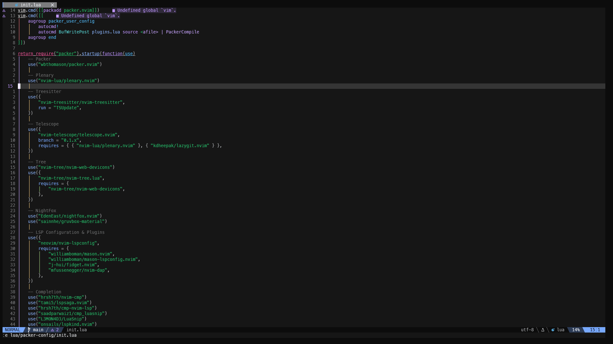

# Neovim

This is my Neovim setup using [packer.nvim](https://github.com/wbthomason/packer.nvim). See my `packer-config` for all of the plugins I use.
(I'm still quite new to Neovim, so my config is probably quite messy)

### Plugins Used

- [nvim-web-devicons](https://github.com/nvim-tree/nvim-web-devicons)
- [lualine](https://github.com/nvim-lualine/lualine.nvim)
- [nvim-tree](https://github.com/nvim-tree/nvim-tree.lua)
- [nvim-autopairs](https://github.com/windwp/nvim-autopairs)
- [treesitter](https://github.com/nvim-treesitter/nvim-treesitter)
- [indent-blankline](https://github.com/lukas-reineke/indent-blankline.nvim)
- [toggleterm](https://github.com/akinsho/toggleterm.nvim)

**Language Server Protocol Plugins**:

- [nvim-lspconfig](https://github.com/neovim/nvim-lspconfig): Required to set up LSP servers.
- [mason](https://github.com/williamboman/mason.nvim): A companion plugin designed for [nvim-lspconfig](https://github.com/neovim/nvim-lspconfig) which assists with quickly installing LSP servers.
- [nvim-cmp](https://github.com/hrsh7th/nvim-cmp): A plugin for code completion.
- [null-ls](https://github.com/jose-elias-alvarez/null-ls.nvim): Required for code diagnostics, linting, and formatting.
